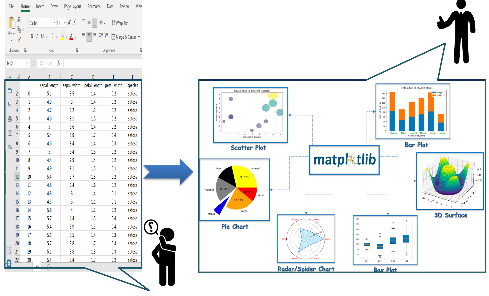
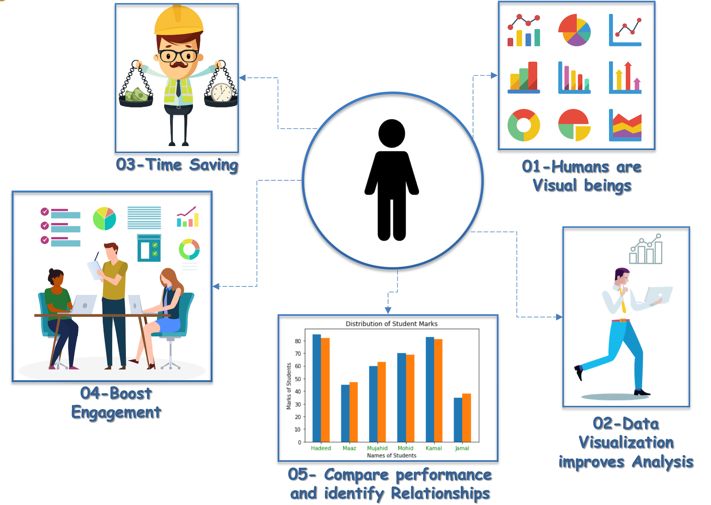

# Data-Visualization

Welcome to the Comprehensive Data Visualization Course repository by Muhammad Sheraz. This repository is your go-to resource for mastering the art of data visualization. Whether you're a beginner, a data enthusiast, or a professional in the field, this course is designed to enhance your skills and proficiency in creating impactful visualizations using various tools and techniques.

  
  

## Course Overview

In this course, we will explore the principles of effective data visualization and dive into practical applications using popular visualization libraries and tools. From basic charts to interactive dashboards, you will learn how to communicate complex data insights in a visually compelling way.

## Lecture 1: Introduction to Data Visualization

- **Introduction to Data Visualization**
- **Chart Chooser**
- **Anatomy of a Figure**
- **Download and Install Matplotlib**
- **How to Draw a Line Chart**
- **Enhance the Graph Step by Step**

## Lecture 2: Basic Charts in Matplotlib

- **Anatomy of a Figure (Recap)**
- **Recap of Line Chart**
- **Bar Plot**
- **Scatter Plot**

## Lecture 3: Advanced Charts in Matplotlib

- **Recap: Anatomy of a Figure, Line, Bar, Scatter Chart**
- **Pie Chart**
- **Histogram**

## Lecture 4: Advanced Charts in Matplotlib

- **Recap: Anatomy of a Figure, Line, Bar, Scatter Chart**
- **Box Plot**
- **Violin Plot**
- **Heatmap**
- **Subplots**

## Lecture 5: Seaborn Library

- **Overview of Seaborn Library**
- **Download and Install Seaborn**
- **Built-in Datasets of Seaborn Library**
- **Plotting with Seaborn**
   - The `relplot()` method
   - The `displot()` method
   - The `catplot()` method

# How to Use This Repository

- Clone this repository to your local machine using `git clone`.
- Navigate to the relevant lecture folders to access code, resources, and notes for each topic.
- Review the provided code examples and run them to understand the practical implementations.
- Apply the concepts learned to your own datasets and projects.
- Contribute, report issues, or suggest improvements to enhance the quality of this repository.

# Get in Touch

If you have questions, suggestions, or feedback, feel free to create an issue or reach out to me via email at [sheraz601050@gmail.com](mailto:sheraz601050@gmail.com).
---

# Happy Visualizing! 📊

I hope you find these lectures valuable in your journey to mastering data visualization. Create engaging visual stories with your data and make a significant impact in conveying insights effectively! 😄

